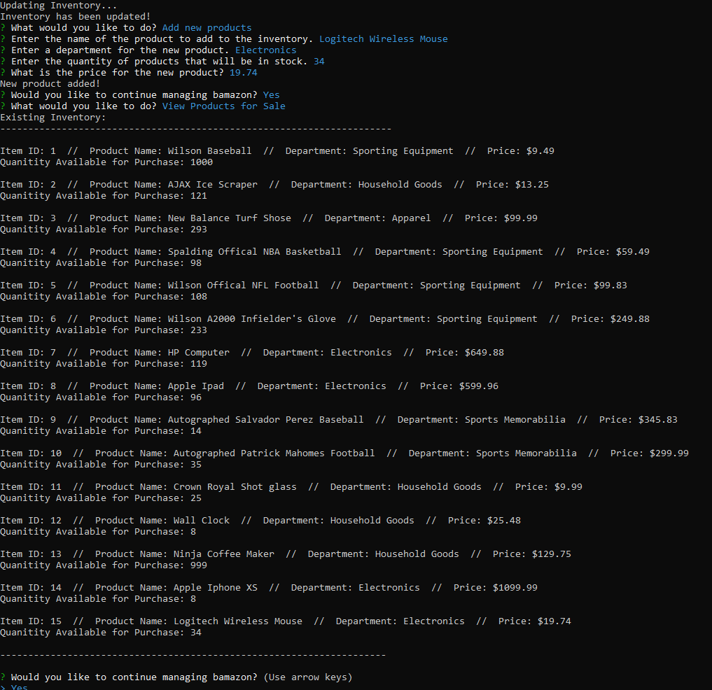

# Bamazon Storefront utilizing mySQL and node.js

## Bamazon Customer Interface
A "Bamazon" store front that utilizes node and mySQL to take orders and update the bamazon database.

This application has the option to be a customer or to be a manager.

Under the customer option, the customer will have the ability to "purchase" items from "Bamazon".

The items are populated from a mySQL database. The initial database was created with 10 items.

This is screen that is shown when the application starts. The customer will choose the item they would like to purchase based on the id number, and then they will be prompted to pick a number they would like to purchase. NPM inquirer was used to create the prompts. 

After purchase is made, the SQL database is updated, customer is giving a total for the products that they ordered, and the customer is prompted if the would like to purchase another item.

## Bamazon Manager Interface

The manager commands allow the manager to view inventory on the command line, view products that are low on invenotry, add inventory to items that are low on stock, and last, add a new product to the database. Inquirer is used to give the manager the option of which function the would like to perform.

### View Inventory - Manager function

This command simply displays the SQL database on the command line.

### View Items that have low inventory.

This command will allow the manager to view any items that have a quantity less than 5

### Add products to the inventory

This command will allow the manager to add quantity to the inventory.

### Add a new product to the database

This command will allow the manager to add a new product to the database

